# freecad-ja-unified

FreeCAD を「迷わない一つの画面」にまとめ、日本語で使えるようにしたもの。
作業場（ワークベンチ）の切り替えを無くし、選んだものに応じてその場で次の操作を出し、
画面の言葉を平易な日本語にそろえた。間違いを見つける「設計の検査」と、モデルを見て直す AI チャットも入れた。
コマンドラインやスクリプトから使うときの不具合も直している。FreeCAD 本家へのパッチの形で置いている（上流には送っていない）。

FreeCAD with one integrated, Japanese-first working environment: no workbench switching,
actions offered next to what you picked, plain Japanese throughout, a design check that finds
and fixes mistakes, an AI chat that works on the model, and fixes for using FreeCAD from the
command line and from scripts. Kept as patches on top of FreeCAD; not submitted upstream.

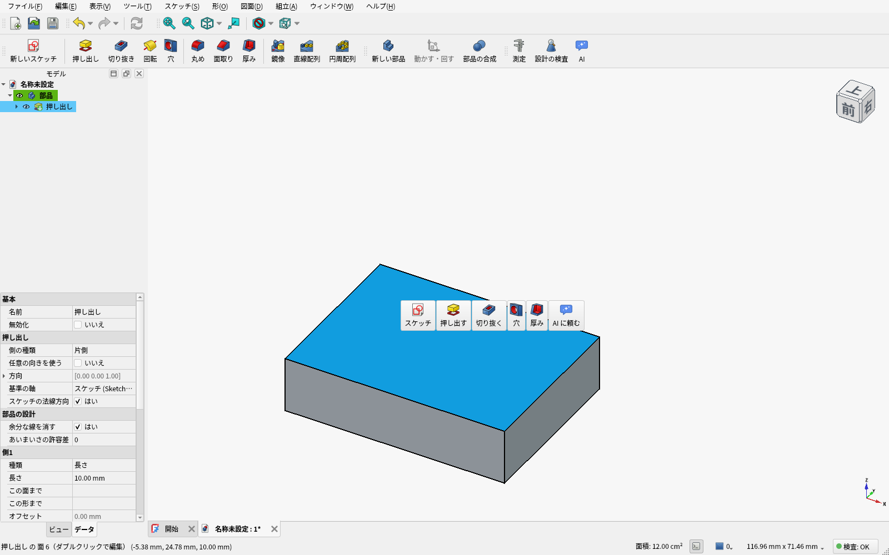

- 元にした版: FreeCAD main `b48098efa`（2026-09-26、バージョン表記 26.3.0dev）
- 同梱の OndselSolver: `4be80eef`

## ダウンロード

[Releases](https://github.com/monyuonyu/freecad-ja-unified/releases) にビルド済みのものを置いている。

- Linux: `FreeCAD_<版>-Linux-x86_64.AppImage`（実行権限を付けてそのまま起動）
- Windows: `FreeCAD_<版>-Windows-x86_64-installer.exe`（インストーラー）または `.7z`（展開して `bin/FreeCAD.exe`）

署名はしていないので、Windows では SmartScreen の警告が出る（「詳細情報」→「実行」）。

設定・マクロ・ウィンドウの配置は本家の FreeCAD と別の場所（`FreeCAD-ja-unified`）に置く。Windows のインストーラーも
本家と別の場所（`FreeCAD-ja-unified 26.3`）に入る。0.3.1 までは本家と共通だった（本家と並べて使うと設定が混ざる）。

## 画面で見る

### 最初の起動

言語・単位・見た目（ライト／ダーク）を選ぶだけ。あとから「編集 → 設定」で変えられる。

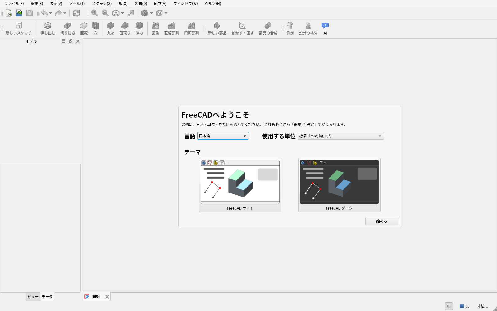

### 新しい部品 → 描く場所をクリック

スタート画面は「新しい部品」「ファイルを開く」だけ。新しい部品を押すと、そのまま描く場所を聞いてくる。
本家のように面を選んでダイアログで OK を押す必要はなく、3D 画面の平面か部品の平らな面を 1 回クリックする。

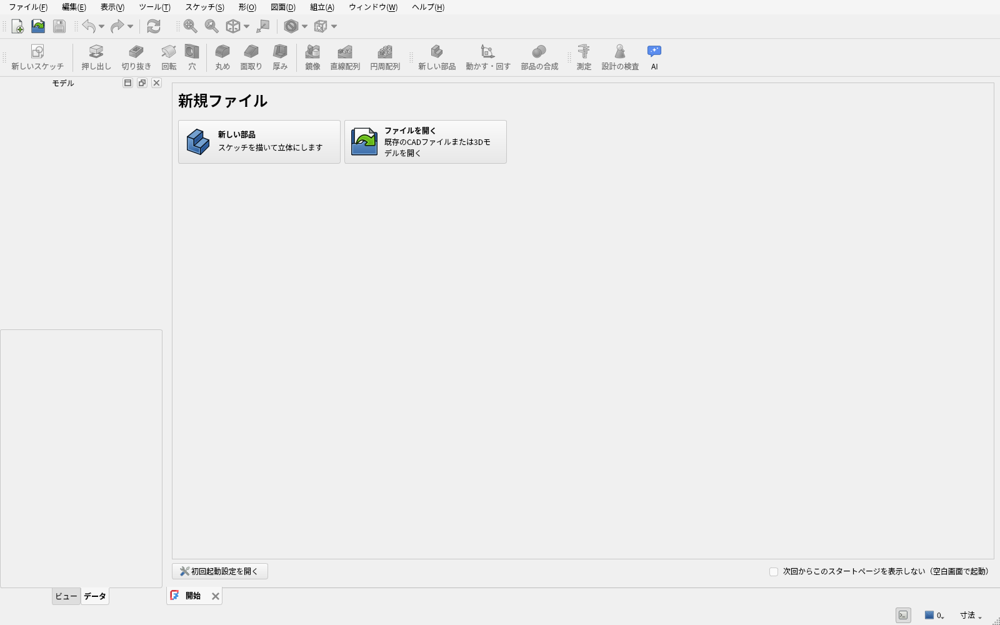

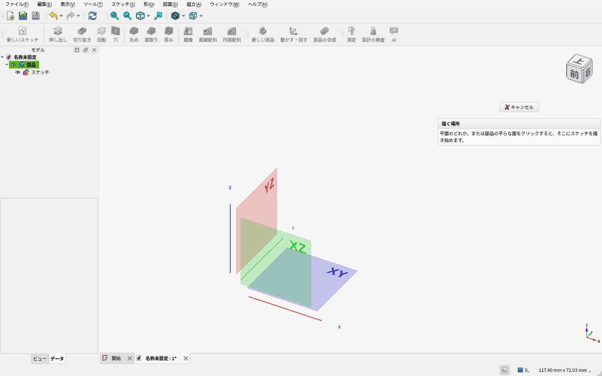

### スケッチ中はスケッチの道具だけ

スケッチを描いている間は、ツールバーがスケッチの道具に切り替わり、終われば元に戻る。
グリッドの点に吸い付くので、マウスで描いても切りのいい寸法になる。決まっていない所の数は日本語で出る。

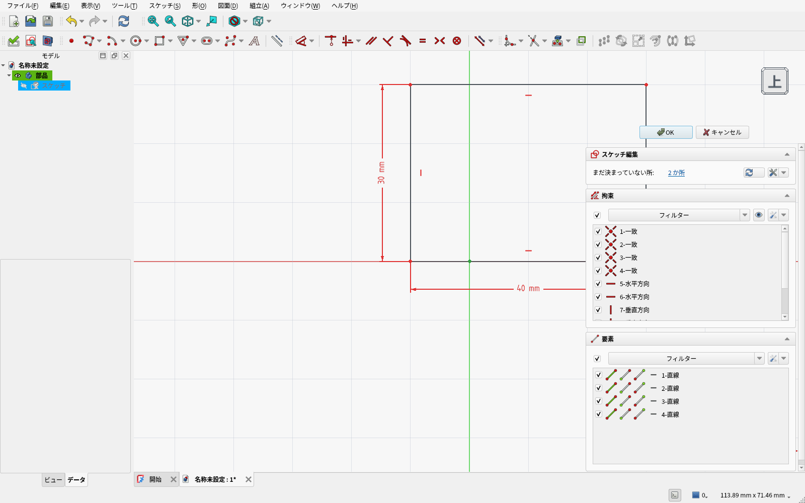

### 描いたら、次の一手が横に出る

スケッチを閉じると、その横に「押し出す・回転・編集・AI に頼む」が出る。ツールバーから探さなくてよい。
ツールバーも主な道具はアイコンの下に名前（押し出し・切り抜き・丸め…）が付いている。

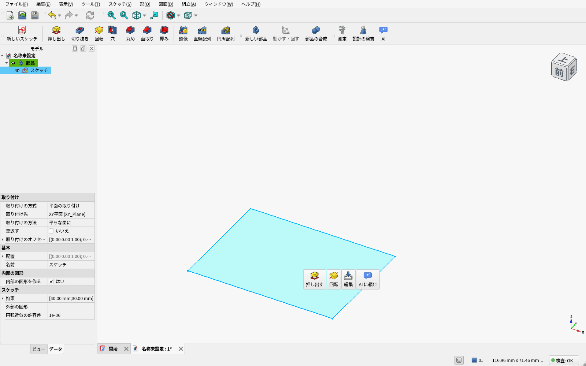

作業パネルは道具を使っている間だけ出て、終わったら消える（モデルが画面に収まるように視点も合わせる）。

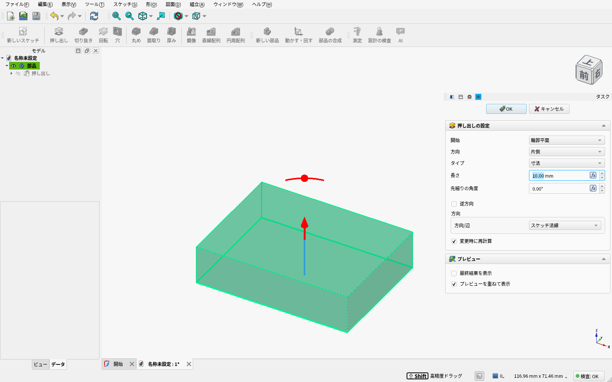

### 面をクリックすると、その面でできること

面ならスケッチ・押し出し・切り抜き・穴・厚み、辺なら丸め・面取りが出る（一番上の画像）。
「穴」は、クリックした位置にそのまま開く（本家は先にスケッチに点を描く必要がある）。
カーソルの下の物は `Preselected: Unnamed.Body.Pad.Face6` ではなく、名前と場所で出る。
面をダブルクリックすると、その面を作った手順（押し出し・丸め…）の編集が開く。


### 設計の検査と「直す」

基板 CAD の DRC のように、モデル全体の間違いを一覧にする。失敗した手順・部品どうしの干渉・スケッチの拘束の矛盾・
浮いた部品・形を見失った図面の寸法など。行を選ぶと部品に寄って、場所に赤い印が出る。
ステータスバーには常に結果（「検査: エラー 2・警告 2」）が出る。

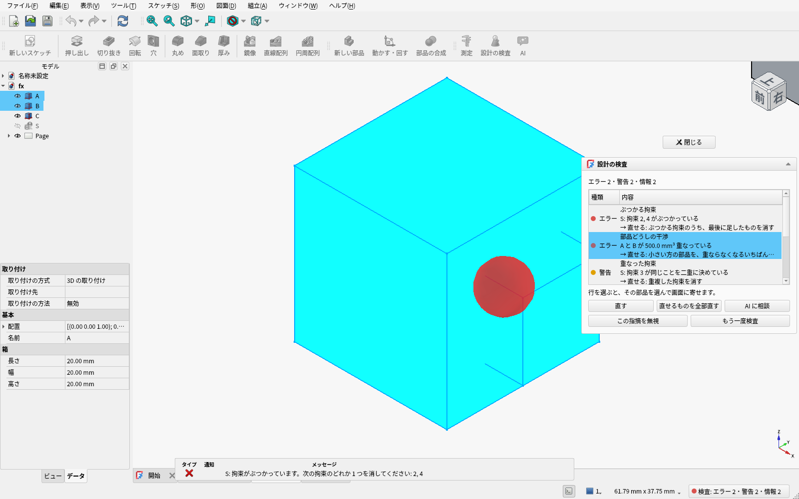

直し方がはっきりしているもの（重複・矛盾した拘束、浮いた部品、重なった部品、空の投影図）は「直す」で直る。
下は「直せるものを全部直す」を押した後。「元に戻す」1 回で全部戻る。

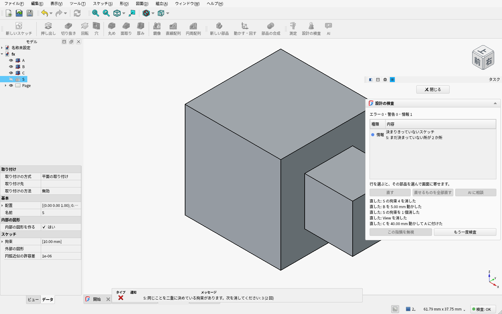

### AI に頼む

右の「AI」パネルで頼むと、AI（Claude）がモデルを見て、直して、設計の検査と画面で確かめて報告する。
面や辺を選んで「AI に頼む」を押せば、選んだ物も一緒に伝わる。AI が実行するコードは毎回表示され、
「実行する」を押したときだけ動く。1 回ごとに「元に戻す」の 1 段になる。

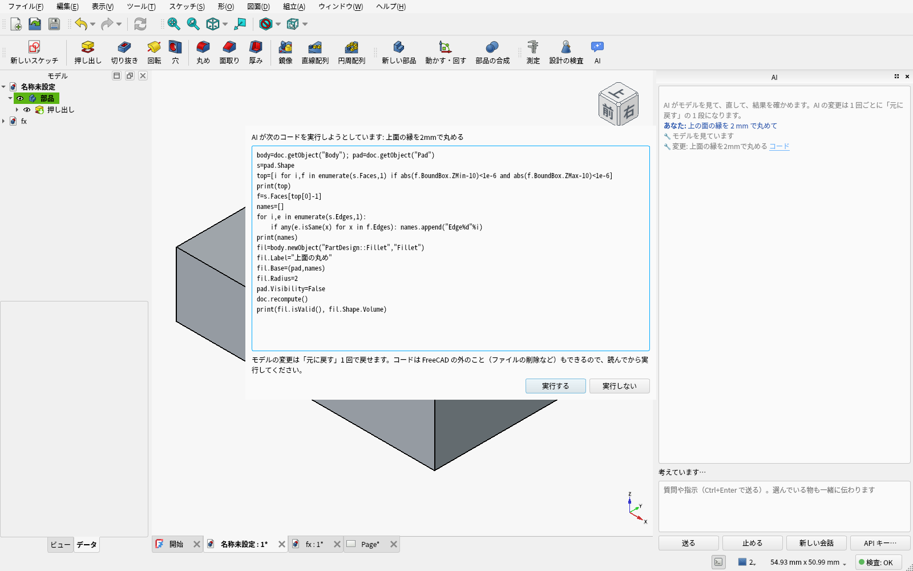

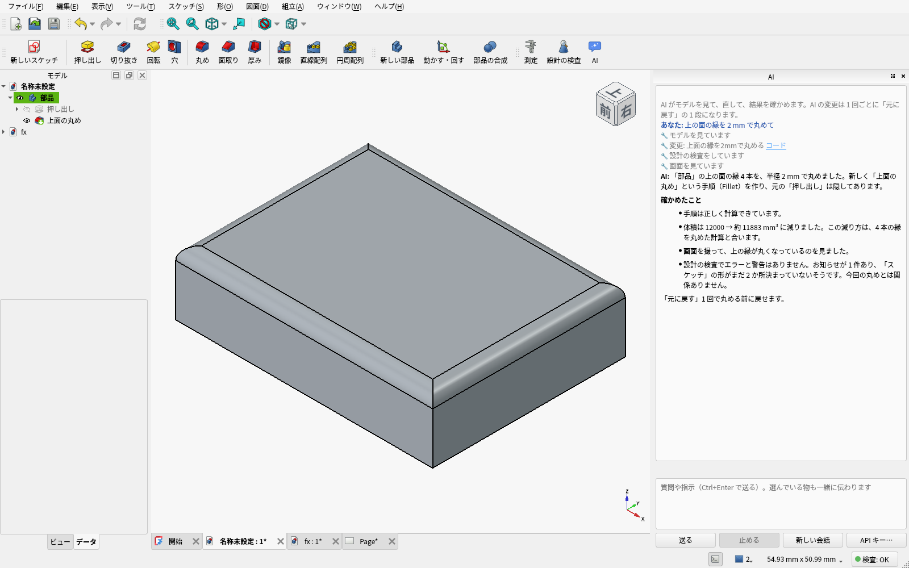

### 失敗の知らせも日本語で

本家では英語のままの失敗の文（`BRep_API: command not done` など）も、何が悪いか・どうすればよいかを日本語で出す。
拘束の番号や辺の番号が入る文も訳す。

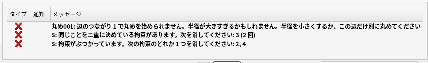

### ナビキューブ

右上の向きを変える立方体は、ふだんは立方体だけ。マウスを乗せると矢印などが現れ、
面の縁や隅に近い所を押せばその辺・角の向きになる（押しやすい）。何が起きるかはツールチップで出る。

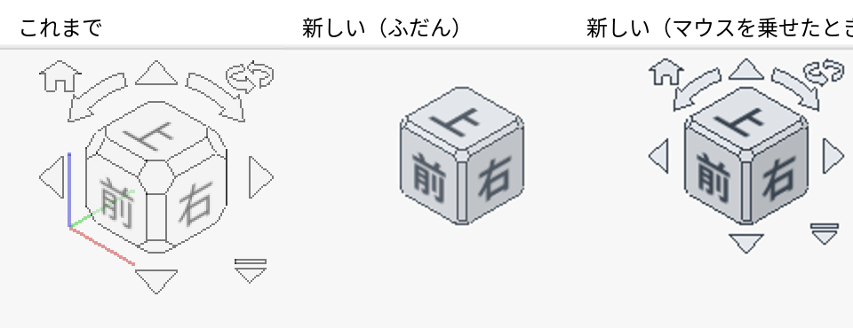

## 本家との違い（一覧）

| | 本家 FreeCAD | このパッチ |
|---|---|---|
| 作業場（ワークベンチ） | Part / PartDesign / Sketcher / Draft / TechDraw / Assembly … を切り替える | 切り替え無し。一つの画面にスケッチ・立体・図面・アセンブリ |
| 2D の作図 | Sketcher と Draft の二本立て | Sketcher に一本化（スケッチ中だけスケッチの道具を出す） |
| 図面・アセンブリ | それぞれの作業場 | 「図面」「アセンブリ」メニューに説明付きで収納 |
| 最初の一歩 | スタート画面の選択肢が多い | 「新しい部品」「開く」だけ。新しい部品はすぐスケッチ面の選択へ |
| スケッチ面の選択 | ダイアログで面を選んで OK | 3D 画面の面や基準面を1回クリック |
| 選んだあとの操作 | ツールバーから探す | 選んだものの横に候補を出す（面→スケッチ/押し出し/切り抜き/薄肉化、辺→角丸め/面取り、スケッチ→押し出し/回転/編集、部品→移動/隠す） |
| ツールバー | アイコンだけ。1600 幅でも一部が「»」の奥に隠れる | 主な道具はアイコンの下に名前（押し出し・切り抜き・丸め…）。スケッチの道具も一列に収まる |
| スケッチの吸着 | 既定では切 | グリッドの点の近くで吸着（マウスで描いても切りのいい寸法になる） |
| カーソルの下の表示 | `Preselected: Unnamed.Body.Pad.Face6` | `押し出し の 面 6` |
| 面をダブルクリック | 何も起きない | その面を作った手順（押し出し・丸め…）の編集が開く |
| 面を選んで「穴」 | 「軸が見つかりません」で失敗（先にスケッチに点を描く必要がある） | クリックした位置に穴 |
| 図面の投影図 | 開き直すまでページの左下に出る（本家の不具合）。第一角法が既定 | ページの中央に出る。第三角法（JIS）が既定 |
| 読み込んだ立体（STEP など）に手を加える | 「アクティブな部品が必要です」のダイアログ | そのままスケッチ・丸め・押し出しができる（自動で部品にする） |
| 何も選ばずにエクスポート | 「オブジェクトを選択してください」で止まる | 見えている部品を書き出す |
| 間違い探し | 「形状を確認」は選んだ 1 つの形が壊れていないかだけ | 「設計の検査」（基板 CAD の DRC に近い）: 失敗した手順・分かれた部品・部品どうしの干渉・スケッチの拘束の矛盾・極端に短い辺・浮いた部品・形を見失った図面の寸法を一覧に。行を選ぶと部品を選んで寄せ、場所に赤い印。「わざと」は無視として文書に記録。直せるもの（重複・矛盾した拘束、浮いた部品、重なった部品、空の投影図）は「直す」ボタンで直す（元に戻す 1 回で戻る）。ステータスバーに常に結果（エラー・警告の数）。コマンドラインでも `FreeCADCmd -c "import DesignCheck; DesignCheck.main('a.FCStd')"` |
| AI に頼む | 無し | 右の「AI」パネルで、AI（Claude）がモデルを見て・直して・検査と画面で確かめる。面や辺を選んだときの候補と、設計の検査の一覧に「AI に頼む」。AI が実行するコードは毎回見せて、承認してから実行（1 回ごとに元に戻す 1 段）。使うには自分の Anthropic API キーが要る（下記） |
| メニュー | 「マクロ」や開発者向けの道具が上に並ぶ | 上のメニューを 1 つ減らし、表示・ツールの上級者向けはサブメニューへ |
| 直線配列の最初の間隔 | 常に 100 mm（小さい部品だと複製が画面の外） | 並べる形の大きさの 2 倍 |
| マウス操作 | 7 種類から選ぶ | 既定は 1 種類（右ドラッグで回転、中ドラッグで移動、ホイールで拡大縮小）。選ぶ画面は出さない |
| 作業パネル | 常に場所をとる | 道具を使っている間だけ出る。終わったらモデルが見えるように視点を合わせる |
| 右クリックメニュー | 項目が多い | モデリングに要るものだけ（ほかは上のメニューに残る） |
| 設定画面 | BIM・アドオンなど使わない頁もある | 使う頁だけ |
| アドオン管理 | あり | 無し（作業場を足す仕組みのため） |

機能は消していない。普段使わないものはメニューの中に説明付きで入れてある。

## AI チャットを使うには

1. 右の「AI」パネルの「AI の準備をする」を押す（Python の仮想環境に claude-agent-sdk と keyring を入れる。ネットワークが要る）
2. [console.anthropic.com](https://console.anthropic.com/) で API キーを作り、「API キー…」で入れる。
   キーは OS の鍵保管庫（Windows の資格情報マネージャー・macOS のキーチェーン・Linux の Secret Service）にしまう。
   鍵保管庫の無い環境では、本人だけが読めるファイル（FreeCAD のユーザーデータの `ai/ai-api-key`）
3. 使った分は API キーの持ち主のアカウントに請求される。このパッチにキーやログインは含まれない

AI はモデル（既定は Opus）に、文書の中身・画面の画像・設計の検査の結果を送る。
AI が実行しようとするコードは毎回表示され、「実行する」を押したときだけ動く（FreeCAD の外のことも書けるので、読んでから）。

## 日本語

- メニュー・ツールバー・作業パネル・通知・設定画面の未訳を埋め、用語を平易な言葉にそろえた
  （例: Pad → 押し出し、Pocket → 切り抜き、Body → 部品、Constraint → 拘束）
- 左のプロパティ欄（項目名・分類・説明・選択肢の値）を日本語に
- 新しく作ったものの名前も日本語（部品、スケッチ、押し出し …）
- 部品の中の原点（Origin）は木の表示から隠す

日本語以外の言語では本家と同じ表示になる。

## コマンドライン・スクリプト

| | 素の FreeCAD | パッチ後 |
|---|---|---|
| スクリプトが例外で落ちる | 終了コード **0**、しかも**2回実行**される、エラーは1行だけ | 1回だけ実行、終了コード 1、トレースバックを表示 |
| `if __name__ == "__main__":` | 実行されない（モジュールとして import される） | 実行される |
| `sys.argv` | FreeCAD の引数そのまま | `FreeCADCmd a.py -- x y` → `['a.py', 'x', 'y']` |
| `sys.exit()` / `sys.exit("msg")` | 1 / メッセージが出ない | 0 / メッセージを標準エラーに |
| 例外や `sys.exit()` の直前の `print` | 消えることがある | 出る |
| 存在しないファイル | 終了コード 0 | `No such file`、終了コード 1 |
| `FreeCADCmd < a.py` | 対話モードで1行ずつ処理（`>>>` が混ざり、エラーでも 0） | 1本のスクリプトとして実行 |
| スクリプト実行時のバナー | 出る | 出ない（対話モードでは出る） |
| STEP の書き出し | OCC の統計が標準出力に2重に出る | 出ない（ログに回す） |
| アセンブリを開く | 拘束ソルバーのメッセージが標準出力に出る | 出ない |
| `Part.export([shape], "a.step")` | **空の STEP を黙って書く** | Shape を受け付ける／何も無ければ `ValueError` |
| `--output` での変換失敗 | 終了コード 0 | 終了コード 1 |
| `--help` | 名前が常に「FreeCAD」、使い方の説明なし | 実行ファイル名・例・終了コード。`--output`（`-o`）と `--hidden` を表示 |
| 設定ファイル | 何もしない実行でも毎回書き直す。並列に走らせると設定が消える | 値が変わったときだけ書く |
| `FreeCAD --hidden a.py` が失敗 | 終了コード 0 | 終了コード 1 |
| `--hidden` で視点を変えて保存 | アニメーションの途中が保存される | アニメーションしない |
| `--hidden` で旧版の設定がある | 設定移行のダイアログが見えない画面に出て**永久に止まる** | ダイアログを出さない |
| `--hidden` の実行 | 最近使ったファイル・ウィンドウ配置を書き換える | 書き換えない |
| Python の `saveImage()` | ナビゲーションキューブが写り込む | 写らない（「画像を保存」メニューと同じ） |

## 本家から取り込んだ修正（PR 一覧）

本家 FreeCAD に出されていて、まだ本家に入っていない PR のうち、精査して取り込んだもの（作者の名前はコミットにそのまま残している）。
開いている 541 件から、この画面が使う部分の落ちる・不具合・退行を中心に絞り、中身を読み、パッチに当たることと試験を確かめた。

**落ちる（クラッシュ）**

- [#32804](https://github.com/FreeCAD/FreeCAD/pull/32804) スケッチの編集に入るとき・マウスを動かしたときに落ちる（@alfrix）
- [#32975](https://github.com/FreeCAD/FreeCAD/pull/32975) スケッチの事前選択で範囲外を読んで落ちる（@alexdremov）
- [#32989](https://github.com/FreeCAD/FreeCAD/pull/32989) スケッチの反転で落ちる（@alfrix）
- [#32970](https://github.com/FreeCAD/FreeCAD/pull/32970) 作業パネルを閉じるときに、解放済みのメモリを触って落ちる（@alexdremov）
- [#32007](https://github.com/FreeCAD/FreeCAD/pull/32007) プロパティ欄で編集中に 3D 画面をクリックするなどして落ちる（6 種類。作業パネルの 1 か所は #32970 と重なるので除いた）（@oursland）
- [#32684](https://github.com/FreeCAD/FreeCAD/pull/32684) 外部参照のファイルを開くと落ちる（@chennes）
- [#31263](https://github.com/FreeCAD/FreeCAD/pull/31263) 起動直後の SpaceMouse の操作で落ちる（@Maik-0000FF）

**形・スケッチ**

- [#32430](https://github.com/FreeCAD/FreeCAD/pull/32430) ポリラインを角丸めすると最後の点が消える（@alfrix）
- [#32759](https://github.com/FreeCAD/FreeCAD/pull/32759) 曲線どうしの点で角丸めできないとき、その理由を出す（@VishalRamKN）
- [#28238](https://github.com/FreeCAD/FreeCAD/pull/28238) 丸め・面取りが失敗したとき、原因（半径が大きすぎる・面がねじれる…）と直し方を出す（@paragforwork）

**図面**

- [#32552](https://github.com/FreeCAD/FreeCAD/pull/32552) 位置をロックしたビューが、読み込むと原点に飛ぶ（@WandererFan）
- [#32151](https://github.com/FreeCAD/FreeCAD/pull/32151) 寸法の参照の修復が、壊れた参照で失敗する（@WandererFan）

**組立**

- [#31998](https://github.com/FreeCAD/FreeCAD/pull/31998) 部品に固定ジョイントを付けるとエラー（@ryneeverett）
- [#32924](https://github.com/FreeCAD/FreeCAD/pull/32924) 親を失ったジョイントのグループを消せない（@PaddleStroke）
- [#32922](https://github.com/FreeCAD/FreeCAD/pull/32922) ラックとピニオンの誤動作（@PaddleStroke）

**表示・画面**

- [#32658](https://github.com/FreeCAD/FreeCAD/pull/32658) ライト／ダークのテーマで、結合した形の色が崩れる（@chennes）
- [#32813](https://github.com/FreeCAD/FreeCAD/pull/32813) 選択の表示の奥行きの退行（@Connor9220）
- [#32841](https://github.com/FreeCAD/FreeCAD/pull/32841) プロパティ欄の選択肢で日本語などが化ける（@maxwxyz）
- [#32996](https://github.com/FreeCAD/FreeCAD/pull/32996) キーボードでツリーを選んだときにステータスバーを更新する（@007stevendigar-lgtm）

**ファイル**

- [#32934](https://github.com/FreeCAD/FreeCAD/pull/32934) ASCII の STL（長い名前・末尾の改行なし）が読めない（@maxwxyz）

あわせて、組立のソルバー（OndselSolver）で、Linux・macOS では組立の書き出し（ASMT）の関節の種類名が壊れる不具合を直した
（型の名前を Windows の形を前提に切り出していた。本家の試験 #32922 が Linux で落ちて分かった）。

## 当て方とビルド

```sh
git clone https://github.com/FreeCAD/FreeCAD.git
cd FreeCAD && git checkout b48098efa && cd ..
./apply.sh FreeCAD

# ビルド（Linux、pixi を使う公式の手順）。FEM/CAM/Robot は時間短縮のため外している
cd FreeCAD
pixi install
pixi run cmake --preset conda-linux-release -DBUILD_FEM=OFF -DBUILD_CAM=OFF -DBUILD_ROBOT=OFF
pixi run cmake --build build/release -j4      # 2 コア 4 スレッドのノートで約 2 時間
pixi run cmake --install build/release        # .pixi/envs/default/bin に FreeCADCmd と FreeCAD
```

## 試験

```sh
XDG_CONFIG_HOME=$(mktemp -d) XDG_DATA_HOME=$(mktemp -d) \
  tests/run.sh <FreeCADCmd のパス> <FreeCAD のパス>
```

設定フォルダは必ず一時フォルダに向けること（本物の設定を汚さないため）。GUI の項目には `xvfb-run` が要る。
素の FreeCAD 1.1.3 では 4/17、パッチ後は全項目（31）合格。
FreeCAD 自身の試験（`FreeCADCmd -t 0`、C++ の Base/App/Part/Gui の試験）もパッチ後にすべて通ることを確かめている。

## リリースの作り方

パッチの書き出しは `tools/export_patches.sh`（FreeCAD の clone の unified-ui から patches/ を作り直す）。


GitHub Actions の「Build release」（`.github/workflows/release.yml`）をタグ名を入れて手で実行する。
元の版にパッチを当て、本家と同じ `package/bundle` の手順で Linux と Windows を作ってリリースに載せる（数時間かかる）。


## ライセンス

パッチは FreeCAD と同じ LGPL-2.1-or-later（`LICENSE`）。
